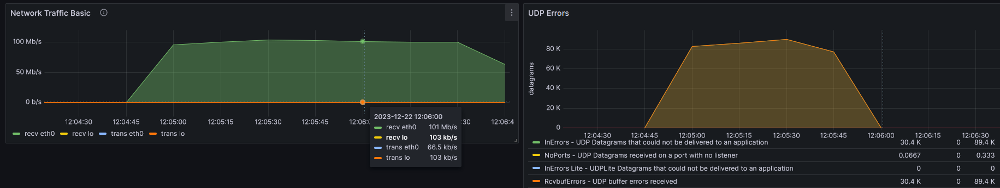

# gmod-netprotect

DDoS protection for Garry's Mod server


# About

This is an anti-ddos solution for garry's mod servers.  
It helps against udp network floods to the gameserver port.

**Warning**: It only works on linux! If you have only a gameserver and not a root-/v-server then this won't work for you!

It was tested on Debian 11 and Debian 12 with a standard 32bit gmod server installed with LinuxGSM.

# Versions

There now exists 2 versions for netprotect: Iptables and Proxy.  
The garrysmod addon is the same for both versions.

The `server_iptables` version has no proxy between player and gameserver. It only has firewall rules (=iptables) which protect the server. This has an advantage of being very "low cost" as the firewall does all the filtering.

The `server_proxy` version has a proxy server between the player and gameserver. Every packet goes through the proxy, which means you can also easily add more rules to it. This has the advantage of being monitor-able via prometheus/grafana while also being very robust.

If you can't decide between versions then use the iptables version as it has been tested more thoroughly.

# Installation

You need to have golang installed.

It is important that your gameserver starts with the

    -allowlocalhttp

start-parameter because without it the gmodserver can't send network messages to the locally running api webserver.

Move the gmod addon folder (named `luctus_netprotect`) into your gmodserver's addons folder and restart the gameserver.


## Iptables version
Basic installation steps are, as root user:

```bash
# Become root if not already:
sudo -i

git clone https://github.com/OverlordAkise/gmod-netprotect.git
cd gmod-netprotect/server_iptables
go get .
go build .
./netprotect &
```

To change the gameport you can use `-gameport 12345`, for more details see `./netprotect -h`.


## Proxy version
Basic installation steps are, as root user:

```bash
# Become root if not already:
sudo -i

git clone https://github.com/OverlordAkise/gmod-netprotect.git
cd gmod-netprotect/server_proxy
go get .
go build .
./netprotect &
```

You can use `./netprotect -help` to view all the options to change tickrate, delay, ports and more.  
After the proxy is running you have to add the firewall rules so that the proxy is actually being used:

```bash
iptables -I INPUT -p udp -m udp --dport 22000 -j ACCEPT
iptables -t raw -A PREROUTING -i eth0 -p udp --dport 27015 -j MARK --set-mark 1
iptables -t raw -A PREROUTING -m mark --mark 1 -j CT --zone-orig 1
iptables -t nat -A PREROUTING -p udp -m mark --mark 1 -j REDIRECT --to-ports 22000
```

To disable the proxy you can use the same rules as above but replace `-A` with `-D`. You can enable or disable these redirect firewall rules whenever you want, the players will NOT notice any impact and you do NOT have to restart the gameserver.


# Usage

To enable the protection simply use the `!netprotect on` chat command or `netprotect on` console command.  
To turn the protection off use `off` in the command instead of "on".


## Results



I sadly haven't been able to capture a distributed denial of service attack yet, but the above is a screenshot of netprotect working against a single attacker (=single ip).  
Because of the 33/s limit a single IP can not take down the gameserver anymore.  
In the above screenshot you can see how the bandwidth (from one ip only) stays the same, but the UDP errors drop immediately after activating luctus netprotect.


## Internal workings of the iptables version

A Garry's Mod server has to listen on a port, by default this is 27015.  
This port only listens for udp and all gameplay-related traffic is only udp, even the initial connection to the gameserver.

If a malicious actor wants to disrupt this gameserver all he has to do is spam udp network traffic onto this port.  
This way the UDP Buffer of linux will constantly be full and new udp traffic will be discarded, which creates an unplayable lag for everyone playing.  
(Simply increasing the UDP buffer won't help much if the incoming traffic is around 400Mbit/s)

Luctus' netprotect is a small api webserver which adds firewall rules that limit the receiving network traffic for the gameserver.

By default (if you exclude the multiplayer browser) you would only want to receive network traffic from the players currently on the server.  
This means that there should not be a lot of udp traffic to port 27015 from non-players.

Luctus' netprotect does this by dynamically inserting firewall rules that limit anyone not currently playing on the server.  
By default it only lets enough packets through for a player to be able to connect (~4 udp packets).  
If the server sees these first packets as an "connection attempt" then it will whitelist that IP to play on the server via a lua addon.  
If the first 5 packets from an IP are not a connection attempt it will be rate limited by the above 5/min rule, because the gameserver hasn't allowed the higher rate.

By default it also limits the packets per second to ~35/s to match the gameserver tickrate. This makes it impossible for a single player with a lot of upload bandwidth to attack the server while he is playing on it.

The activation of the protection has to be done from within the gmodserver because the players already on the server have to be added to the whitelist immediately, and only the gmodserver knows these players and their IP.

The rules look something like this if the protection is active:

```bash
$ iptables -S
#[...]
-A INPUT -p udp -m udp --dport 27015 -j GMOD
#[...]
-A GMOD -p udp -m udp --sport 1900 -j DROP
-A GMOD -p udp -m udp --sport 123 -j DROP
-A GMOD -p udp -m udp --sport 53 -j DROP
-A GMOD -p udp -m udp --dport 27015 -m hashlimit --hashlimit-above 35/sec --hashlimit-burst 5 --hashlimit-mode srcip --hashlimit-name mainmain -j DROP
-A GMOD -s 1.2.3.4/32 -p udp -m udp --dport 27015 -j ACCEPT
-A GMOD -p udp -m udp --dport 27015 -m hashlimit --hashlimit-above 1/min --hashlimit-burst 5 --hashlimit-mode srcip --hashlimit-name main -j DROP
#[...]
```

The first rule redirects requests coming to port 27015 to our new chain which protects our gmodserver.  
The first 3 rules in the GMOD chain disable a commonly used "performance testing" service which can be used to DDoS servers. They only send traffic from these 3 ports (1900/123/53) and we disable that for our gmod port. I have seen this happen live before and simply disabling these 3 source ports made the attack not work anymore.  
The next one is the 35/second limit that no player should exceed on a 33 ticks per second server.  
Between the 2 hashlimit rules are the whitelist rules for players. Here, Index 5 in the iptables chain, will all the players reside.  
Last but not least is the anti-ddos rule itself. If you are not a player and not already exceeding 40packets/second then you will be blocked by this 1 per minute rule.

I highly recommend to not let this protection be always on.  
Multiplayer queries arrive at port 27015 via udp too and I am unsure, even after a lot of testing, if these protecting firewall rules break anything.


## Internal workings of the proxy version

This is a single core application but it still is able to forward 1000 packets per second easily.

The average delay of forwarding (seen by prometheus) is ~100µs for 1-3 packets per second, ~80µs for 66 packets per second and when benchmarking it ~20µs for 10.000 packets per second.

The go proxyserver rebuilds the packets of the clients from scratch and resends it to the actual gameserver via loopback interface. The rebuilding uses google's "gopacket" module and works very quickly. We need root privilege because we send custom network packages. We need to set the source IP to the clients IP so that the gameserver doesn't send the response through the proxy but instead directly to the client/player.

The proxy triples the network bandwidth used for the gameserver, which is visible in grafana. It receives the data, forwards it to the gameserver and the gameserver receives the data. This means you have eth0-in -> lo0-out -> lo0-in instead of a single eth0-in. This should not be a problem thanks to the 3packets/min/ip filter of the proxy. (I also tested it without this filter and my 4core linux server was able to easily handle 500Mbit/s \* 3 for minutes on end)
